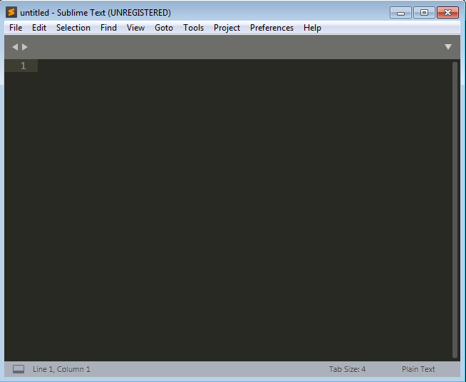
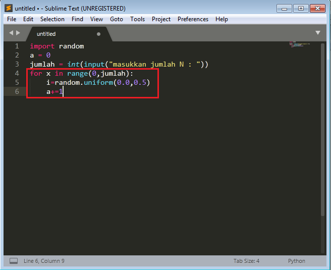
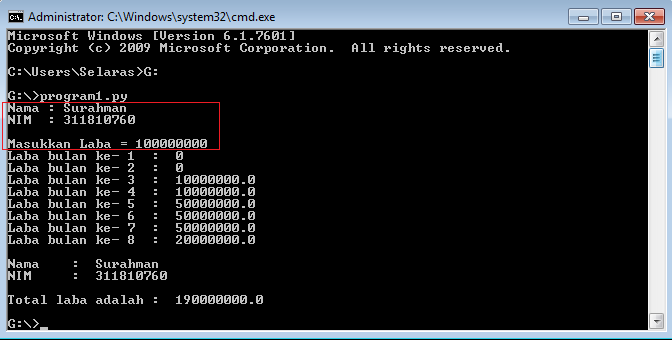

# labpy03

# Cara membuat program yang menampilkan nilai N bilangan acak yang lebih kecil dari 0.5

1. Buka sublime text

2. Masukkan kode input yang berfungsi untuk memasukkan data yang ingin di program

3. Masukkan kode "for x in range" yang berfungsi untuk looping (mengulang) input sesuai yang di inginkan

4. Masukkan kode output yang berfungsi untuk menampilkan hasil

5. Lalu save dan pilih format/syntax "python"

6. Buka cmd lalu masukkan lokasi penyimpanan file py (python) yang telah di buat, contoh seperti yang di tandai

7. Lalu masukkan data input yang ingin di program

8. Maka akan tampil output/hasil seperti berikut

# Cara membuat program untuk menampilkan bilangan terbesar dan break/berhenti jika di beri input-an 0

1. Buka sublime text

2. Masukkan kode input yang berfungsi untuk memasukkan data yang ingin di program

3. Masukkan kode if seperti berikut untuk menampilkan input-an berulang-ulang dan berhenti jika di beri input-an 0

4. Masukkan kode output yang berfungsi untuk menampilkan hasil

5. Lalu save dan pilih format/syntax "python"

6. Buka cmd lalu masukkan lokasi penyimpanan file py (python) yang telah di buat, contoh seperti yang di tandai

7. Lalu masukkan data input yang ingin di program, input akan terus muncul dan cara menghentikannya dengan memasukkan angka 0

8. Maka akan tampil output/hasil seperti berikut

# Cara membuat program sederhana dengan perulangan

1. Buka sublime text

2. Masukkan kode input yang berfungsi untuk memasukkan data yang ingin di program

3. Masukkan kode "for x in range" yang berfungsi untuk looping (mengulang) input sesuai yang di inginkan

4. Masukkan kode output yang berfungsi untuk menampilkan hasil

5. Lalu save dan pilih format/syntax "python

6. Buka cmd lalu masukkan lokasi penyimpanan file py (python) yang telah di buat, contoh seperti yang di tandai

7. Lalu masukkan data input yang ingin di program

8. Maka akan tampil output/hasil seperti berikut

Sekian dari saya

Terima Kasih

(note: Maaf pemberian nama dan nim pada program hanya di program1.py saja karna saya lupa dan terlanjur)